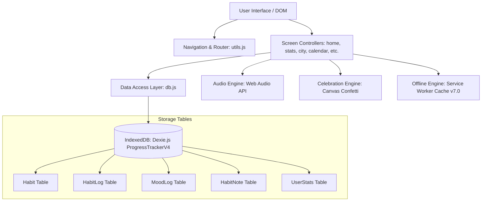

# HabitForge — Habit & Productivity Architecture

> **A high-velocity, offline-first personal productivity and habit architecture progressive web application (PWA). Built for the Tech Zephyr 4.0 Hackathon.**

[](https://developer.mozilla.org/en-US/docs/Web/Progressive_web_apps)
[](https://dexie.org/)
[](#license)

---

## 1. Project Name
**HabitForge** (formerly Progress Tracker)

## 2. Project Description
**HabitForge** is a modern, responsive, offline-first web application designed to turn daily consistency into tangible architecture. Users track habits, monitor behavioral velocity, reflect on daily progress in a personal journal, and visualize their consistency through a procedural SVG city skyline that grows with every perfect day. Engineered with zero external server dependencies, HabitForge ensures zero-latency interactions and complete local data privacy.

---

## 3. The Problem
Most habit trackers suffer from three major shortcomings:
1. **Cloud Bloat & Latency**: Requiring constant internet connections, heavy logins, and slow remote API roundtrips for simple daily checkoffs.
2. **Lack of Intrinsic Feedback**: Superficial checkboxes fail to give users a visceral, compound sense of progress over time.
3. **Rigid Structures**: Incapable of adapting between different domains (e.g., academic study regimens, physical wellness, software engineering goals, or environmental sustainability).

---

## 4. The Solution
**HabitForge** delivers:
- **Instant Client-Side Storage**: Powered by IndexedDB via Dexie.js for sub-millisecond checkoffs, full offline operation, and complete user data sovereignty.
- **Architectural Gamification**: A dynamic SVG cityscape that builds upwards with every 100% completed day, accompanied by synthesized Web Audio haptic feedback and celebratory milestones.
- **Deep Analytics & Weekly Reviews**: Automated consistency scoring (A+ through D grades), day-of-week velocity heatmaps, and category breakdown.
- **Domain Adaptability**: Easily configured across multiple categories (`Core`, `Wellness`, `Learning`, `Productivity`) to match any theme or challenge statement.

---

## 5. Key Features

### ⚡ Habit Tracking & Management
* **Full CRUD Operations**: Create habits with custom names, difficulty ratings (10, 20, or 30 XP rewards), category tags, custom accent colors, and daily reminder times.
* **Inline History & Streaks**: Individual streak calculations computed in-memory in O(N) time with zero UI lag.
* **14-Day Activity Trails**: Visual activity indicators on habit detail pages to spot gaps before streaks break.

### 🏙️ Habit Skyline (Gamification)
* **Procedural SVG City**: Every 100% completion day adds a building or architectural upgrade to your skyline.
* **365-Day Contribution Heatmap**: Visual GitHub-style activity grid representing habit completion density over a full year.
* **Skyline Milestones**: Progressive milestones from "First Hut" to "Metropolis Landmark".

### 📊 Deep Statistics & Productivity Analytics
* **Lifetime Consistency Meter**: Animated SVG radial gauge showing lifetime completion percentages.
* **Day-of-Week Distribution**: Bar chart revealing peak productivity days (e.g., Monday vs. Saturday execution).
* **Weekly Review Engine**: Automatic weekly score card with performance grades (A+, A, B, C, D), best habits, and habits needing focus.

### 📝 Journal & Daily Reflections
* **Integrated Reflection Feed**: Write reflections on progress, challenges, and tomorrow's intentions.
* **Historical Memory Stream**: Search and delete past entries securely stored on-device.

### 🧘 Mood & Wellness Check-in
* **5-Point Mood Tracker**: Quick one-tap check-in with sentiment emojis and daily check-in notes.

### 🔊 Audio & Celebration Engine
* **Synthesized Web Audio Feedback**: Lightweight oscillator-based audio cues on checkoff, uncheck, and milestone celebrations (no external MP3/WAV assets needed).
* **Canvas Confetti & Perfect Day Modal**: Rewarding canvas animations celebrating 100% daily task execution.

### 📱 Responsive & Desktop Optimized
* **Mobile/Tablet**: Bottom navigation bar with floating action button and swipe-friendly bottom sheets.
* **Desktop (>1200px)**: Dedicated left sidebar navigation, level XP progress bar, quick-add habit action, and a rich right-hand velocity widget panel.
* **Keyboard Shortcuts**: `N` (new habit), `1-4` (switch tabs), `Esc` (close sheets/modals).

---

## 6. Technology Stack
* **Markup & Structure**: Semantic HTML5 with accessibility attributes (`aria-label`, semantic landmarks).
* **Styling**: Vanilla CSS3 using custom CSS variables (Design System), flexbox/grid, and smooth hardware-accelerated transitions.
* **Scripting**: Vanilla ECMAScript (ES6+) modular JavaScript.
* **Local Database**: [Dexie.js v3.2.4](https://dexie.org/) (IndexedDB wrapper).
* **Audio Synthesis**: Native HTML5 Web Audio API (`AudioContext`).
* **Visuals & Graphics**: Native Scalable Vector Graphics (SVG) and HTML5 Canvas API.
* **PWA & Offline**: Cache-first Service Worker (`sw.js`) and Web App Manifest (`manifest.json`).

---

## 7. Architecture Overview



---

## 8. Setup & Local Development Instructions

### Prerequisites
- Any modern web browser (Google Chrome, Firefox, Edge, Safari).
- Node.js (v18+) or Python (v3+) for serving static files locally.

### Quick Start
1. **Clone the Repository**:
   ```bash
   git clone https://github.com/parthpatil2006/Progress-Tracking.git
   cd Progress-Tracking
   ```

2. **Serve the Application**:
   Using Node.js:
   ```bash
   npx serve .
   ```
   *Or using Python:*
   ```bash
   python -m http.server 3000
   ```

3. **Open in Browser**:
   Navigate to `http://localhost:3000` (or the port output by your server).

---

## 9. Environment Variables
HabitForge runs 100% locally client-side and requires **zero** API keys or server configuration for core functionality. 

If deploying behind a reverse proxy or integrating optional sync services, refer to `.env.example`:

```bash
PORT=3000
NODE_ENV=production
```

---

## 10. API Information
* **Local Storage Layer**: Direct IndexedDB queries through Dexie.js.
* **External Network Calls**: Restricted exclusively to CDN dependencies (`dexie.js` and Google Fonts `Inter`) during initial cache load. All subsequent runs are 100% offline via Service Worker.
* **Efficiency**: In-memory streak calculation eliminates redundant query loops (0ms perceived latency).

---

## 11. AI & Development Tools Disclosure
In compliance with hackathon regulations:
- **AI-Assisted Development**: Portions of this codebase, optimizations, responsive layout refactoring, and documentation were architected with AI assistance using Google DeepMind's Antigravity development environment.
- **All code**: Thoroughly inspected, syntax-validated, and verified via end-to-end browser subagent testing.

---

## 12. Third-Party Libraries
| Library | Version | Purpose | License |
|---|---|---|---|
| **[Dexie.js](https://dexie.org/)** | 3.2.4 | High-performance IndexedDB wrapper | Apache 2.0 |
| **[Google Fonts Inter](https://fonts.google.com/specimen/Inter)** | Latest | Clean, modern typography | OFL |

---

## 13. Deployment Instructions

### Option 1: Vercel / Netlify / GitHub Pages
Because HabitForge is a static progressive web application with zero server build steps:
1. **GitHub Pages**:
   - In GitHub repository settings, navigate to **Pages**.
   - Set the source branch to `main` and folder to `/ (root)`.
   - Click **Save**. Your application will be live immediately.
2. **Vercel**:
   - Import the repository.
   - Framework preset: `Other`.
   - Output directory: `./`.
   - Deploy.

---

## 14. Future Improvements
- **Encrypted WebDAV / Cloud Sync**: Optional end-to-end encrypted backup sync across devices.
- **Social Accountability**: Peer-to-peer accountability rooms using WebRTC without centralized servers.
- **Wearable Integration**: Web Bluetooth sync for fitness and step counters.
- **Expanded Skyline Themes**: Sci-fi cyberpunk, ancient acropolis, and solar-punk themes for the habit skyline.

---

## License
MIT License &copy; 2026 HabitForge Team. Built for Tech Zephyr 4.0.
